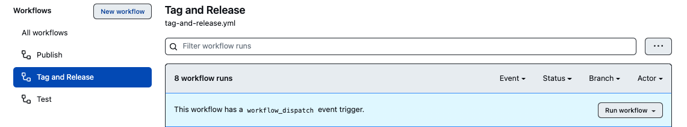
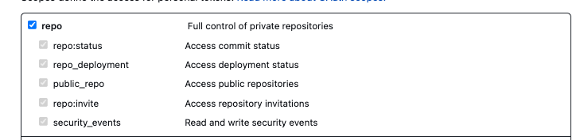

<h1 align="center">hyper-ci-bump</h1>
<p align="center">A Github action to bump manifest files based on the provided semver compatible version</p>
</p>

---

## Table of Contents

- [Getting Started](#getting-started)
- [API](#api)
- [License](#license)

## Getting Started

This action can be used as part of any Github workflow.

- Bump manifest files (according to latest semver compatible Git tag)
- Generate changelog (disabled by default)
- commit changes
- tag new commit

This can then be pushed back to the repo using `git push --follow-tags`

> This module itself is versioned using `hyper-ci-bump`. Check out
> [the tag and release workflow](./.github/workflows/tag-and-release.yml)

## Using in a workflow

A great way to use this action is part of a
[workflow dispatch](https://docs.github.com/en/developers/webhooks-and-events/webhooks/webhook-events-and-payloads#workflow_dispatch)

With this, tagging and releasing can all be done via the Github UI!

```yml
name: 🔖 Tag and Release

on:
  workflow_dispatch:
    inputs:
      # See https://github.com/hyper63/hyper-ci-bump#inputs for available inputs for the bump action
      version:
        description: the semver version to bump to
        required: true

jobs:
  release:
    runs-on: ubuntu-latest
    steps:
      - name: ⬇️ Checkout repo
        uses: actions/checkout@v3
        with:
          # Allows for pushes from this workflow to trigger subsequent workflows
          token: ${{ secrets.GITHUB_TOKEN }}
          # 0 means pull down all history, so all tags can be grep'd
          fetch-depth: 0

      - name: ⎔ Setup node
        uses: actions/setup-node@v3
        with:
          node-version: 18.x

      - name: 🤓 Set Git User
        run: |
          git config --global user.name "${{ github.actor }}"
          git config --global user.email "${{ github.actor }}@users.noreply.github.com"

      - name: ✊ Bump
        id: bump
        uses: hyper63/hyper-ci-bump@v2
        with:
          bump-to: ${{ github.event.inputs.version }}

      - name: ⬆️ Push
        run: |
          git push --follow-tags

      - name: 🤖 Create Github Release
        if: steps.bump.outputs.tag
        uses: softprops/action-gh-release@v1
        with:
          tag_name: ${{ steps.bump.outputs.tag }}
        env:
          GITHUB_TOKEN: ${{ secrets.GITHUB_TOKEN }}
```

You'll then see a new "Run Workflow" button on the `Actions` page of your repo:



### Triggering subsequent workflows

When you use `GITHUB_TOKEN` in your actions, all of the interactions with the
repository are on behalf of the Github-actions bot. The operations act by
Github-actions bot cannot trigger a new workflow run. If you'd like to trigger
subsequent workflows ie. off the new commit or tag created, you will need to use
a personal access token, provided as `token` during the `actions/checkout@v3`
job:

```yml
jobs:
  release:
    runs-on: ubuntu-latest
    steps:
      - uses: actions/checkout@v3
        with:
          fetch-depth: 0
          # now pushes from this workflow can trigger subsequent workflows
          token: ${{ secrets.YOUR_PAT }}
  ...
```

Your token will need to have `repo` permissions:



## API

### Inputs

- _string_ `bump-to` **Optional**: the semver comptaible version to bump to. If
  the string "semver" or nothing is passed, then it will semver bump the package
  based on commit messages, following conventional-commit standards. When semver
  bumping, the most recent git tag is used as the base version. **If no base
  git tag is found, `v1.0.0` is used as the base to bump from**.
- _string_ `package` **Optional**: the package name that contains the files to
  bump. Great for repos with multiple independently versioned packages ie. in a
  monorepo. Example: `app-opine` will find a package in `*/**/app-opine`
- _string_ `prefix` **Optional**: prefix to use for the git tag. Example:
  `app-opine` prefix and `v1.3.2` version will result in a tag of
  `app-opine@v1.3.2`. **default**: the `package` input.
- _string_ `runtime` **Optional**: This dictates which manifest files are
  bumped. Currently supports `node`, `deno`, or `javascript`. The following
  table shows which manifest files will be bumped for each runtime. **default**:
  `javascript`

| runtime                      | manifest files bumped                           |
| ---------------------------- | ----------------------------------------------- |
| `deno`, `node`, `javascript` | `egg.json`, `package.json`, `package-lock.json` |

TODO: add some more run times

### Outputs

- _string_ `version`: The semver version bumped to
- _string_ `tag`: The git tag created, if tagging was performed. Otherwise
  `undefined`

### Configuration

a `.versionrc` can be used to override behavior. For example, to enable
generation of a changelog, create `.versionrc` file at the root of the project
like this:

```json
{
  "skip": {
    "changelog": false
  }
}
```

Now a changelog will be generated and/or appended to for the repo. Any of the
following lifecycle steps can be enabled/disabled using this method:

`bump`, `changelog`, `commit`, `tag`

By default, `bump`, `commit`, and `tag` are enabled.

## License

Apache-2.0

## Contributing

Logic can be found in `main.js` and dependencies are provided via `index.js`.
This is a github action, so `node_modules` are intentionally committed to the
repo.
